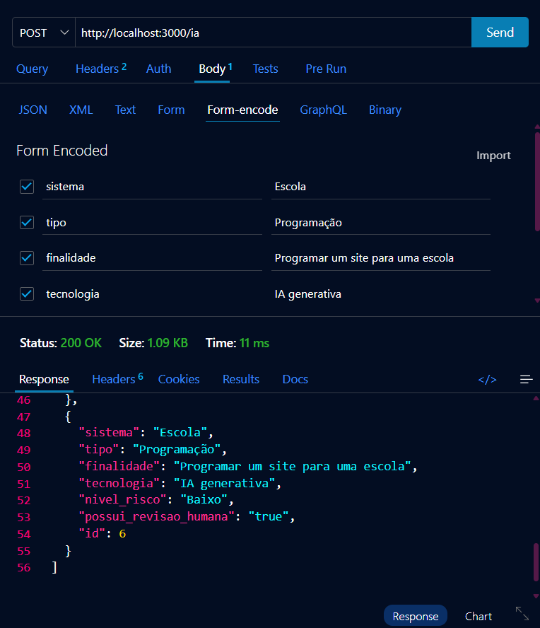
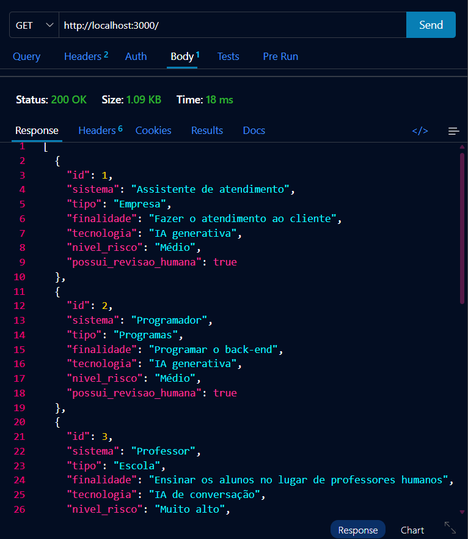
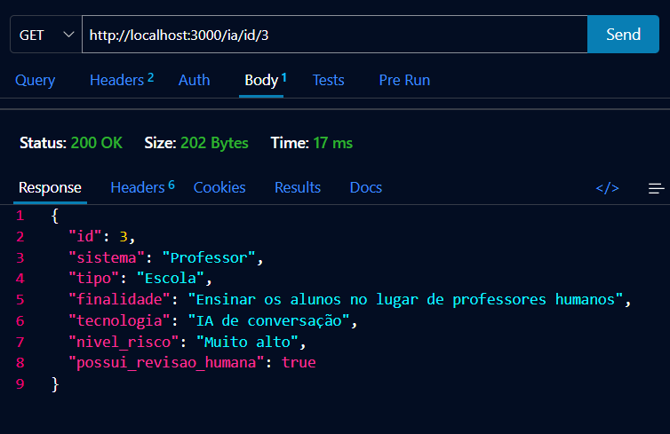
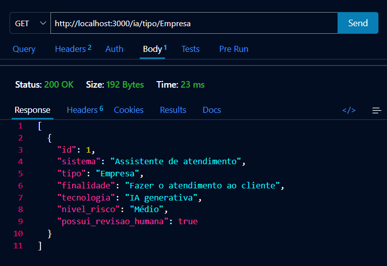
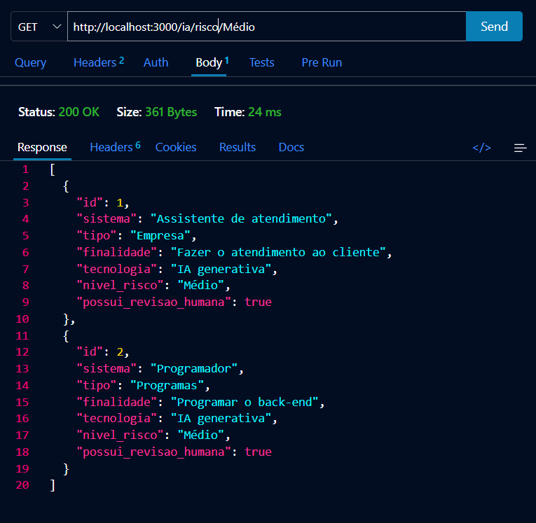
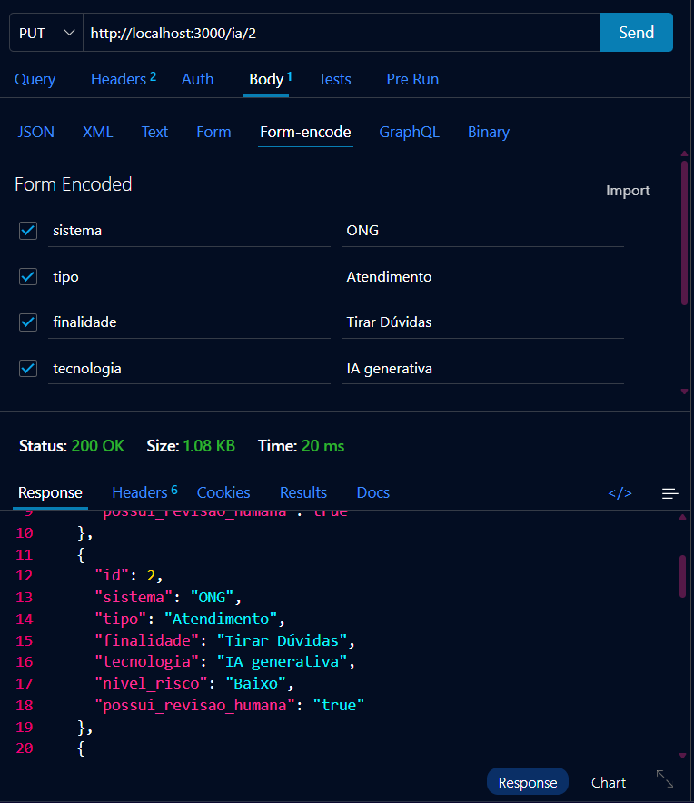
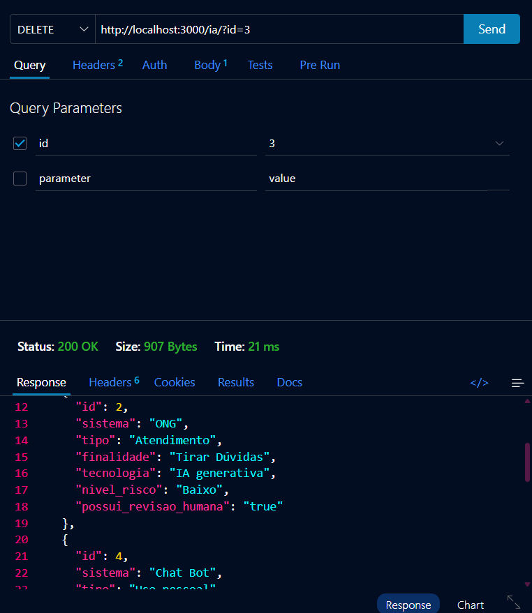

# Pesquisa de Campo - VPS01 Back-End
Atividade realizada para obtenção de nota para a matéria de Programação Back-End
<br>

## Tecnologias
- <b>Node.js</b>
- <b>JavaScript</b>
- <b>VsCode</b>
- <b>VsCode</b> Thunder Client

<br>

## Passos para testar
- 1° Clone este repositório
- 2° Abra-o com o VsCode, abra um terminal e digite:
```
npm install
npm run dev
```
- 3° Teste as rotas GET, POST, DELETE e PUT com a extensão <b>Thunder Client</b>
- 4° Abra o Front-End `index.html` com a extensão <b>Live Server</b>

<br>

## Prints dos testes e exemplos de requisições
- CREATE (POST)

- READ ALL (GET)

- READ Id

- READ Tipo

- READ Risco

- UPDATE (PUT)

- DELETE


<br>

## Cliente
